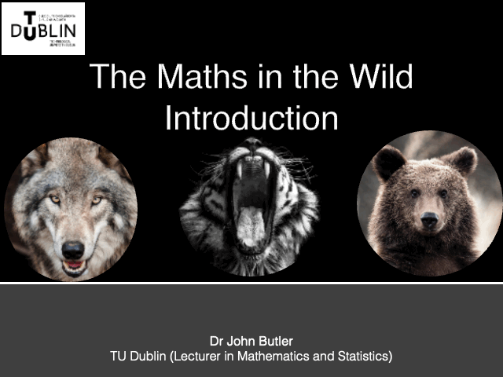

Before starting the workshop introduce yourself, what your day is, what you research. 

## Biography

  
  The workshops were written by [John Butler](https://johnsbutler.netlify.app), a maths lecturer at TechnologicalUniversity Dublin. John combines his knowledgeof mathematics and neuroscience to create experiments and analysis techniques thatlet us explore the world through maths.
  

| Image | Text |
|-------|------|
|   |   Scríobhadh na ceardlanna agJohn Butler,léachtóir matamaitice in Ollscoil Teicneolaíochta Bhaile Átha Cliath. Comhcheanglaíonn John a chuid eolais ar mhatamaitic agus néareolaíocht chun turgnaimh agus teicnící anailíse a chruthú a ligeann dúinn an domhan a fhiosrú tríd an matamaitic. |

## Materials

### Slides

[Introduction Slides](Maths_in_the_Wild_Introduction.pptx)

## References

1. Brady, R. M., & Butler, J. S. (2021). The Circle of Life: The Mathematics of Predator‑Prey Relationships. Frontiers for Young Minds, 9, 651131. [https://doi.org/10.3389/frym.2021.651131]
2. ’t Hart, B. M., Achakulvisut, T., Adeyemi, A., Akrami, A., Alicea, B., Alonso‑Andres, A., … van Viegen, T. (2022). Neuromatch Academy: a 3‑week, online summer school in computational neuroscience. Journal of Open Source Education, 5(49), 118. https://doi.org/10.21105/jose.00118
3. Campos, J. L., Pandi, M., & Butler, J. S. (2020). “Feeling” Ourselves Move: A Team Effort by Our Senses. Frontiers for Young Minds, 8(9). DOI: [https://doi.org/10.3389/frym.2020.00009] 
4. Hoxha, I., Mudrik, N., Urai, A. E., Kienigiel, D., Forest, J., Abdelhack, M., Peters, M., Halper, N., Zhang, R.-Y., Lu, X., & Butler, J. S. (2023, August 24–27). Opening Computational Neuroscience to a Wider Audience: Virtual Escape Room for Kids [Poster presentation]. Conference on Cognitive Computational Neuroscience, Oxford, United Kingdom. https://doi.org/10.32470/CCN.2023.1197-0
5. McLoughlin, C. (2024, August 23). The Digital Mirror: TCIN and Dr John Butler at the Dublin Makers Festival, Richmond Barracks. Retrieved June 9, 2025, from https://www.cianmcloughlin.com/news/35-the-digital-mirror-tcin-and-dr-john-butler-at-the-dublin/
