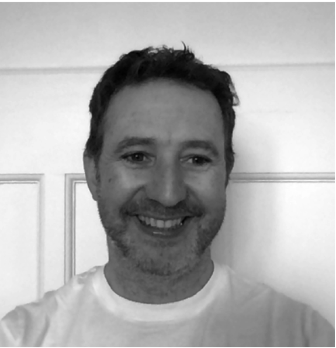
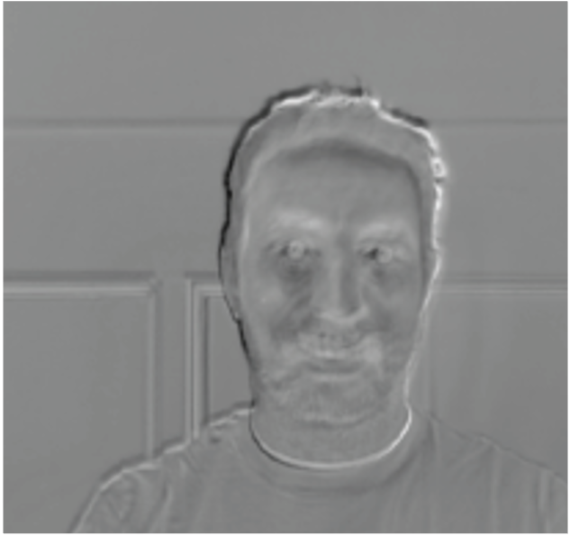
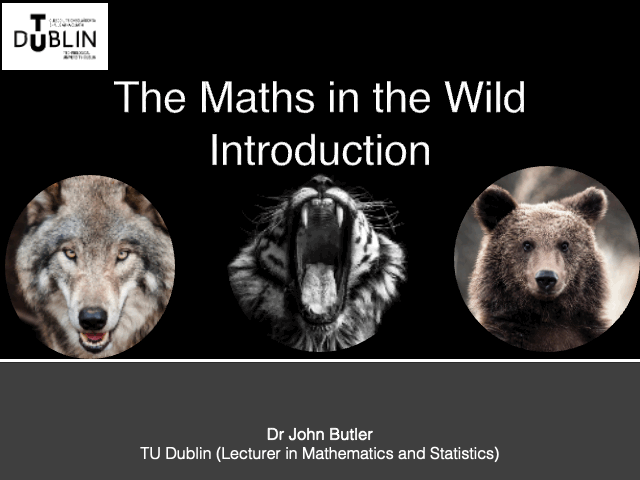

We wrote the materials so everyone from young to old can learn about how maths is used in many different ways.

## The Authors

|       | Biography  |
|-------|------|
|   |   [Dr John Butler](https://johnsbutler.netlify.app), is a maths lecturer at Technological University Dublin. John combines his knowledge of mathematics and neuroscience to create experiments and analysis techniques thatlet us explore the world through maths. |
|  | Scríobhadh na ceardlanna ag John Butler, léachtóir matamaitice in Ollscoil Teicneolaíochta Bhaile Átha Cliath. Comhcheanglaíonn John a chuid eolais ar mhatamaitic agus néareolaíocht chun turgnaimh agus teicnící anailíse a chruthú a ligeann dúinn an domhan a fhiosrú tríd an matamaitic. |
|   |  [Dr Nicole Beisiegel](https://researchprofiles.tudublin.ie/en/persons/nicole-beisiegel-2) is a maths lecturer at Technological University Dublin. Nicole combines her knowledge of mathematics and climate to model coastal flooding as well as extreme flood events caused by severe storms, hurricanes, and tsunamis. |
|  | [Dr Nicole Beisiegel](https://researchprofiles.tudublin.ie/en/persons/nicole-beisiegel-2) ist Mathematikdozentin an der Technologischen Universität Dublin. Nicole verbindet ihr Wissen über Mathematik und Klima, um Küstenüberschwemmungen sowie extreme Flutereignisse durch schwere Stürme, Hurrikane und Tsunamis zu modellieren. |

## Materials

### Introduction Slides
Before starting the workshop introduce yourself have a chat about what you do day to day.

[Introduction Slides](Maths_in_the_Wild_Introduction.pptx)

## References

1. Brady, R. M., & Butler, J. S. (2021). The Circle of Life: The Mathematics of Predator‑Prey Relationships. Frontiers for Young Minds, 9, 651131. [https://doi.org/10.3389/frym.2021.651131]
2. ’t Hart, B. M., Achakulvisut, T., Adeyemi, A., Akrami, A., Alicea, B., Alonso‑Andres, A., … van Viegen, T. (2022). Neuromatch Academy: a 3‑week, online summer school in computational neuroscience. Journal of Open Source Education, 5(49), 118. https://doi.org/10.21105/jose.00118
3. Campos, J. L., Pandi, M., & Butler, J. S. (2020). “Feeling” Ourselves Move: A Team Effort by Our Senses. Frontiers for Young Minds, 8(9). DOI: [https://doi.org/10.3389/frym.2020.00009] 
4. Hoxha, I., Mudrik, N., Urai, A. E., Kienigiel, D., Forest, J., Abdelhack, M., Peters, M., Halper, N., Zhang, R.-Y., Lu, X., & Butler, J. S. (2023, August 24–27). Opening Computational Neuroscience to a Wider Audience: Virtual Escape Room for Kids [Poster presentation]. Conference on Cognitive Computational Neuroscience, Oxford, United Kingdom. https://doi.org/10.32470/CCN.2023.1197-0
5. McLoughlin, C. (2024, August 23). The Digital Mirror: TCIN and Dr John Butler at the Dublin Makers Festival, Richmond Barracks. Retrieved June 9, 2025, from https://www.cianmcloughlin.com/news/35-the-digital-mirror-tcin-and-dr-john-butler-at-the-dublin/
