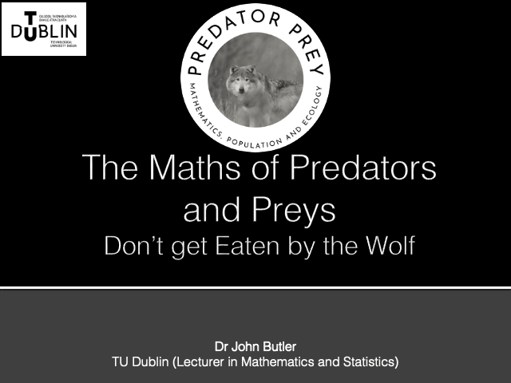

The workshop takes around 60-90 minutes, it introduces students to mathematical modelling in ecology using predator-prey relationships. Through real-world examples like hares and lynx, students explore how populations grow, interact, and decline depending on food sources and predation.

The core focus is on:

- The maths of population growth
- The maths of population extinction
- The equations for population dynamics
- How maths can model natural systems
- The importance of balance between species

The maths
cannot not only recreate the observations
but also be used to model if there is a change
in the environment like the reintroduction of
Wolves into Ireland.

  

    <h3 style="margin:0 0 0.5rem;"><a href="#Materials">Materials</a></h3>
    
Lesson Plan and Slides.

  

  

    <h3 style="margin:0 0 0.5rem;"><a href="#Handouts">Handouts</a></h3>
    
Worksheets and MCQs

  

(A) The number of hare pelts collected (in tens of thousands) over time. (B) The number of lynx pelts collected (in tens of thousands) over time, inferred from Hudson Bay Company data from 1895 to 1935

### Irish curriculum alignment
What the workshop does mathematically: Students work with population data, plot graphs, interpret how two variables (predator and prey numbers) change over time, and explore the idea that equations can model real-world systems.

<table border="1">
    <thead>
        <tr>
            <th>Subject</th>
            <th>Primary</th>
            <th>Junior Cycle</th>
            <th>Leaving Cert</th>
        </tr>
    </thead>
    <tbody>
        <tr>
            <td>Science / Biology</td>
            <td>living things, habitats, food chains</td>
            <td> Biological World, ecology, predation</td>
            <td> Ecology unit, population dynamics</td>
        </tr>
        <tr>
            <td>Applied Maths</td>
            <td>—</td>
            <td>—</td>
            <td> Mathematical Modelling strand</td>
        </tr>
        <tr>
            <td>Geography</td>
            <td> natural environments</td>
            <td> Population, Migration, and the Environment</td>
            <td>Human Environment, Geoecology</td>
        </tr>
        <tr>
            <td>Agricultural Science</td>
            <td>—</td>
            <td>—</td>
            <td>pest control, animal populations</td>
        </tr>
        <tr>
            <td>SESE Environmental Awareness</td>
            <td>interdependence, ecosystems</td>
            <td>—</td>
            <td>—</td>
        </tr>
    </tbody>
</table>

## Materials
<section id="Materials">
</section>

[Predator Prey Teacher Lesson Plan](LessonPlan/01_MitW_LessonPlan_Predator_Prey.pdf) Start here — includes timing, learning objectives and preparation notes.

[Predator Prey Slides](Maths_in_the_Wild_Predator_Prey.pptx)

### Handouts
<section id="Handouts">
</section>

|Handout|Solution|
|-------|--------|
|[Predator Prey Worksheet](WorkSheets/01_MitW_Worksheet_Predator_Prey.pdf)|[Solutions](WorkSheets/01_MitW_Predator_PreyWorksheet_Solutions.pdf)|
|[Predator Prey 2-page Worksheet](WorkSheets/01_MitW_Worksheet_Predator_Prey_2page.pdf)|[Solutions](WorkSheets/01_MitW_Worksheet_Predator_Prey_2page_Solutions.pdf)|
|[Predator Prey MCQ](MCQs/01_MitW_MCQs_Predator_Prey.pdf)|[Solutions](MCQs/01_MitW_MCQs_Predator_Prey_Solutions.pdf)|

### Certificate of Completion

[Predator Prey Cert](Cert/01_MitW_Certificate.pdf)

The material is released under [CC-BY-NC](https://creativecommons.org/licenses/by-nc/4.0/?utm_source=substack&utm_medium=email). Feel free to share and adapt them. 

### Feedback Forms

|[Student Feedback Form](https://forms.office.com/Pages/ResponsePage.aspx?id=yxdjdkjpX06M7Nq8ji_V2q-wIvl2CEdBnFykVKs9cpNUMFBNWFY4R1hDUjU2SjRNU0xKR1o2Q0RYTi4u) | [Teacher Feedback Form](https://forms.cloud.microsoft/Pages/ResponsePage.aspx?id=yxdjdkjpX06M7Nq8ji_V2q-wIvl2CEdBnFykVKs9cpNUOTVMWE0zVUhJVTVPUEpGTUQyVDdXNEs3Vi4u)| 

## References

Brady, R. M., & Butler, J. S. (2021). The Circle of Life: The Mathematics of Predator‑Prey Relationships. Frontiers for Young Minds, 9, 651131. [https://doi.org/10.3389/frym.2021.651131](https://doi.org/10.3389/frym.2021.651131) [PDF](BradyButler2021.pdf)

