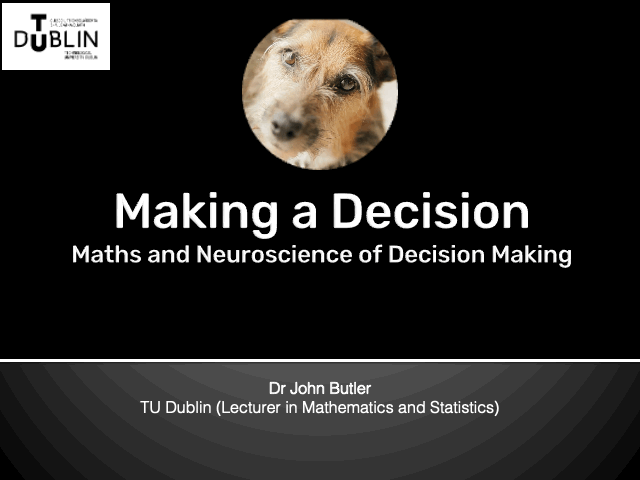

This workshop shows how making simple decisions can be modelled and predicted using maths. The same formula has been used to model a particle moving in space.

The workshop blends neuroscience with mathematical modelling to explore how the brain gathers evidence, handles uncertainty, and responds to time pressure when making choices. 

Using an example students can relate to, “Should I walk or cycle to school?” they learn how concepts like drift, noise, and evidence accumulation are used to model decisions in both everyday life and scientific research. 

It links the maths model to real brain processes and encourages students to see decision-making as a dynamic, measurable phenomenon. 

## Materials

# Decision Making Workshop — Cross-Curricular Links

The Decision Making workshop explores how the brain reaches a conclusion under uncertainty, using a mathematical framework called the drift-diffusion model. Rather than deciding instantly, the brain accumulates noisy evidence over time until it crosses a threshold — and the workshop shows how adjusting that threshold creates a fundamental trade-off between speed and accuracy. 

## Curriculum Links

| Subject | Primary | Junior Cycle | Leaving Cert |
|---|---|---|---|
| Mathematics | Data and Chance |  Statistics and Probability  | Statistics and Probability |
| Science | Working Scientifically| Nature of Science  | Biology — Nervous System |
| Applied Mathematics | — | — | Mathematical Modelling  |
| Business Studies | — | hhow businesses and individuals make decisions under uncertainty | — |
| SPHE / CSPE | Making decisions |  Critical thinking  | — |
| PE / Physical Education | — |  reaction time and decision making in sport | L tactical decision making under pressure|

### Slides

[Decision Making Slides](Maths_in_the_Wild_DecisionMaking.pptx)

### Worksheet

[Decision Making Worksheet](WorkSheets/04_MitW_Worksheet_DecisionMaking.pdf)

[Decision Making Worksheet Solutions](WorkSheets/04_MitW_Worksheet_DecisionMaking_Solutions.pdf)

### Mutiple Choice Quiz

[Decision Making MCQ](MCQs/04_MitW_MCQs_DecisionMaking.pdf)

[Decision Making MCQ Solutions](MCQs/04_MitW_MCQs_DecisionMaking_Solutions.pdf)

### Lesson Plan

[Decision Making Teacher Lesson Plan](LessonPlan/04_MitW_Lesson_Plan_DecisionMaking.pdf)

### Certificate of Completion

[Decision Making Cert](Cert/04_MitW_Certificate.pdf)

This workshop was originally created for [Neuromatch](https://neuromatch.io) for Kids, and a more adult-friendly version (written with Rebecca Brady) appears on RTÉ Brainstorm, exploring the maths behind another everyday decision: [“Should I have another pint or go home?”](https://www.rte.ie/brainstorm/2025/1013/1390329-maths-neuroscience-decisions-brain-behaviour/)

## References

Hoxha, I., Mudrik, N., Urai, A. E., Kienigiel, D., Forest, J., Abdelhack, M., Peters, M., Halper, N., Zhang, R.-Y., Lu, X., & Butler, J. S. (2023, August 24–27). Opening Computational Neuroscience to a Wider Audience: Virtual Escape Room for Kids [Poster presentation]. Conference on Cognitive Computational Neuroscience, Oxford, United Kingdom. https://doi.org/10.32470/CCN.2023.1197-0
