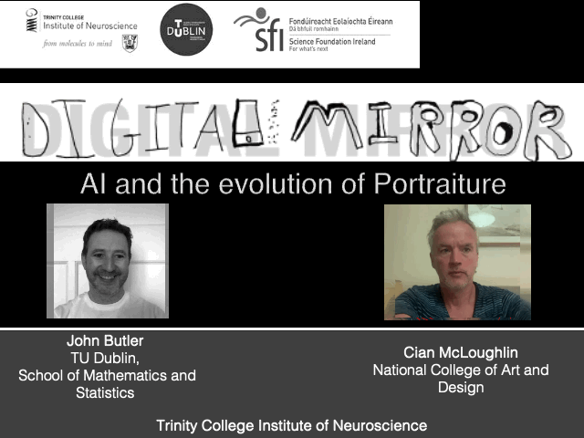

This workshop is a collaboration between John and artist [Cian McLoughlin](https://www.cianmcloughlin.com) that explores the intersection of art, neuroscience, mathematics, and machine learning through the evolution of portraiture and face recognition.

It connects:

- How artists try to capture the essence of a person,
- How the brain recognises faces using the Fusiform Face Area (FFA),
- How mathematics represents faces through dimensionality reduction,
- How computers use Eigenfaces and machine learning to recognise and re-create faces.
- The presentation culminates in the idea that only a few images are needed to form a mathematical “portrait”, an Eigenface, representing the essence of a person, not just their appearance.

## Materials

### Slides

[Face Recognition Slides](Maths_in_the_Wild_DigitalMirror.pptx)

### Worksheets

[Face Recognition Maths Worksheet](WorkSheets/MitW_FaceRecogWorksheet.pdf) 

[Face Recognition Maths Worksheet Example Solution](WorkSheets/MitW_FaceRecogWorksheet_Solution.pdf)

[Face Recognition Art Worksheet](Worksheets/DigitalMirror_handout.pdf)

[Face Recognition Shorter Worksheet](WorkSheets/MitW_FaceRecogWorksheet_Shorter.pdf) 

[Face Recognition Worksheet Shorter Example Solution](WorkSheets/MitW_FaceRecogWorksheet_Shorter_Solution.pdf)

### Mutiple Choice Quiz

[Face Recognition MCQ](MCQs/05_MitW_MCQs_Digital_Mirror.pdf)

[Face Recognition MCQ Solutions](MCQs/05_MitW_MCQs_Digital_Mirror_Solutions.pdf)

### Lesson Plan

[Face Recognition Teacher Lesson Plan](LessonPlan/05_MitW_LessonPlan_FaceRecog.pdf)

This workshop was originally developed during Cian’s artist residency at the Trinity College Institute of Neuroscience, supported by Taighde Éireann - Research Ireland. 

## References

McLoughlin, C. (2024, August 23). The Digital Mirror: TCIN and Dr John Butler at the Dublin Makers Festival, Richmond Barracks. Retrieved June 9, 2025, from https://www.cianmcloughlin.com/news/35-the-digital-mirror-tcin-and-dr-john-butler-at-the-dublin/ 

